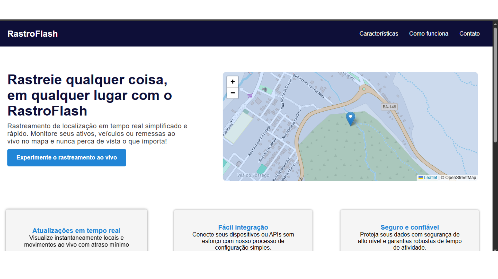

# 📍 Flask Rastreador de Localização

Este projeto é uma aplicação web que rastreia e exibe a localização geográfica de um dispositivo (como notebook ou celular) em tempo real, usando **Python (Flask)** no back-end e **Leaflet.js** no front-end.

---


---
## 🚀 Funcionalidades

- Envia localização (latitude, longitude, precisão) do navegador para a API
- Armazena e exibe a última posição recebida
- Mapa interativo com **Leaflet + OpenStreetMap**
- Atualização automática da posição
- Histórico de coordenadas (temporário)

---

## 🛠️ Tecnologias utilizadas

- Python 
- Flask
- HTML + CSS + JavaScript
- Leaflet.js
- OpenStreetMap

---

## 📦 Instalação local

```bash
git clone https://github.com/juniornovaisx/flask-rastreador.git
cd flask-rastreador
python -m venv venv
source venv/bin/activate  # Ou venv\Scripts\activate no Windows
pip install -r requirements.txt
python app.py
